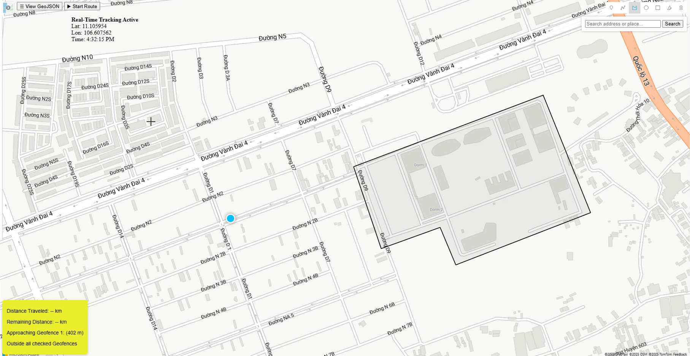

## 📍 Azure Maps Integration for Real-Time GPS Tracking


This web application uses **Azure Maps** and **Azure SignalR** to display real-time GPS data from mobile devices. It also supports drawing geofences and detecting entry/exit events.

---

## 🛠️ Requirements



- A modern web browser (Chrome, Edge, Firefox, etc.)
- An [Azure Maps](https://learn.microsoft.com/en-us/azure/azure-maps/) subscription key
- An Azure IoT Hub and a registered device
- A GPS-enabled Android phone running `send_gps.py` via Termux
- An Azure SignalR Service for real-time messaging
- An Azure Function App (e.g., `mygpsfuncapp`) that acts as the GPS processor

---

## 📦 Configuration

### 1. Configure `function.json` in your Azure Function

In `gpsprocessor/function.json`, add your Event Hub-compatible name from your IoT Hub:

```json
{
  "scriptFile": "__init__.py",
  "bindings": [
    {
      "name": "events",
      "type": "eventHubTrigger",
      "direction": "in",
      "eventHubName": "YOUR-EVENT-HUB-COMPATIBLE-NAME",
      "connection": "EventHubConnectionString",
      "cardinality": "many"
    },
    {
      "type": "signalR",
      "name": "$return",
      "hubName": "gpsHub",
      "connectionStringSetting": "AzureSignalRConnectionString",
      "direction": "out"
    }
  ]
}
````

### 2. Configure `local.settings.json`

Create this file in your Azure Function project root:

```json
{
  "IsEncrypted": false,
  "Values": {
    "AzureWebJobsStorage": "Your-AzureWebJobsStorage-ConnectionString",
    "FUNCTIONS_WORKER_RUNTIME": "python",
    "EventHubConnectionString": "Your-EventHubConnectionString",
    "AzureSignalRConnectionString": "Your-AzureSignalRConnectionString"
  }
}
```

### 3. Publish the Azure Function

Using Azure CLI, deploy your function:

```bash
az login
az functionapp publish mygpsfuncapp
```

### 4. Edit `index.html` (Frontend)

Set your Azure Maps subscription key (there may be 4 instances):

```javascript
subscriptionKey: 'YOUR-SUBSCRIPTION-KEY'
```

Update the SignalR negotiation URL:

```javascript
const NEGOTIATE_URL = location.hostname === "localhost"
    ? "http://localhost:7071/api/negotiate"
    : "https://mygpsfuncapp.azurewebsites.net/api/negotiate";
```

You can find the subscription key under:

* **Azure Portal → Azure Maps → Keys**

---

## 📡 How It Works

1. **Map Initialization**: Loads Azure Maps centered on a default location.
2. **Drawing Geofences**: A toolbar lets users draw polygons for geofencing.
3. **SignalR Integration**: Connects to Azure SignalR to receive live GPS data from your phone.
4. **Geofence Detection**: Checks each incoming coordinate against the drawn polygons.
5. **Real-Time Display**: Pins and paths update instantly as data is received.

---

## 📤 Key Features

* ✏️ Draw custom geofences directly on the map
* 📍 Real-time GPS updates from a mobile device
* 🚨 Alerts when entering or exiting geofenced areas
* 🚚 Simulates a route of an incoming truck using starting and ending pins.

---

## 🚀 Running the Application

1. Open **PowerShell** and **Git Bash** in your project directory.
2. Start the Azure Function in PowerShell:

   ```bash
   func start
   ```
3. Serve the frontend in Git Bash (or similar) on port 5500:

   ```bash
   python -m http.server 5500
   ```
4. Run `send_gps.py` on your phone using **Termux**.
5. Open your browser and visit:

   ```
   http://localhost:5500/
   ```

---

## 🧪 Example Output

In your browser:

```
📡 Real-Time Tracking Active
Lat: 12.345678
Lon: 98.765432
Time: 12:34:56
```

On Termux:

```
📡 Provider: gps
🚦 Speed: 0.0 km/h
🎯 Accuracy: 5.2 meters
📤 Sending GPS: {"latitude":12.345678,"longitude":98.765432,"altitude":5.6,"timestamp":1715176342}
```

---

## 🛑 Stopping the Application

To stop the app:

* Press `Ctrl + C` in both PowerShell and Git Bash
* Close the browser
* Stop `send_gps.py` on your phone with `Ctrl + C`

---

## 📎 License

This application is provided for **educational and prototyping purposes only**.

---

## 🙋 Need Help?

Check the following if you're having trouble:

* ✅ Azure Maps key is valid and active
* ✅ Azure SignalR and Function App are deployed and configured
* ✅ IoT Hub device is sending data
* ✅ Network connection is stable
* ✅ Your phone's location services are enabled

---

## 📝 Known Issues

* ❗ **404 CSS/JS Errors**: Ensure the Azure Maps SDK URLs are correct and accessible.
* ❗ **SignalR Fails to Connect**: Confirm your negotiation endpoint is correct and your Azure Function is running.
